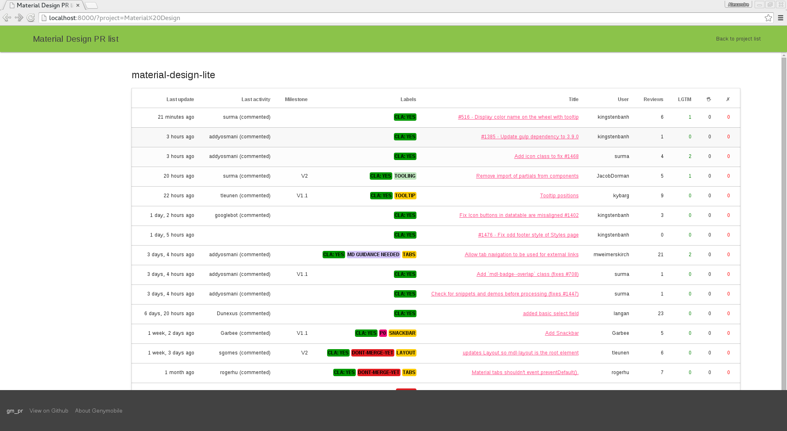

# gm_pr: A multi project Github pull request viewer


If your project is spread over multiple git repositories, it can be hard to
keep track of all the open pull requests.

The gm_pr project gives you a simple web page where you can see all the open
pull requests with the number of reviews, labels, milestones, etc



As a bonus, we also have a slack bot :-)

## Installation

The recommended method to run gm_pr is to use the docker image.

A Dockerfile is available in the "deploy" folder. Building and running the image
can be done in a few lines:

```
cd deploy
docker build -t gm_pr .
docker run -v /path/to/gm_pr:/var/www/gm_pr --name gm_pr -p 8000:80 -d gm_pr
```

Optionally, you may specify some projects and repositories to be created,
by using this `docker run` command instead:
```
docker run -e GM_PR_INITIAL_PROJECTS="proj1=repo1,repo2;proj2=repo3,repo4" -v /path/to/gm_pr:/var/www/gm_pr --name gm_pr -p 8000:80 -d gm_pr
```

Now, you can simply point your browser to http://localhost:8000.

If you want to make gm_pr available on your external interface, configure a
reverse proxy with apache. You can use this snippet:

```
<Proxy http://localhost:8000/>
        Order deny,allow
        Allow from all
</Proxy>

ProxyPass /gm_pr http://localhost:8000
ProxyPassReverse /gm_pr http://localhost:8000

<Location /gm_pr/bot>
        Require all granted
</Location>
```

## Configuration

2 files are used for configuration:

 * gm_pr/settings.py: this is the standard Django configuration file
 * gm_pr/settings_projects.py: configure your Github and Slack organization and authentication here.

### Django configuration

Refer to the django project if you want to change the configuration.
Normally you should only need to adjust a few settings:

**ALLOWED_HOSTS** You may want to add the name of your server if you use
the docker / apache configuration.

**STATIC_URL** Add the full URL to your static directory

### Gm_pr configuration

Open **gm_pr/settings_projects.py** and read the comments. You'll need to change
most of the configuration here, but the file is self-documenting.

### Slack configuration

You can see your pull requests from Slack.

You need to add a "slash command" in the slack settings:

 * Open https://mydomain.slack.com/services/new/slash-commands
 * Choose a command name, for eg: "/pr"
 * For the URL, append "/bot/" to your gm_pr URL.
 * In order to make things easy with the Django CSRF protection, you have to
 choose the GET method.
 * Copy the token and add it in **settings_project.py** (**SLACK_TOKEN**)
 * click on "Save Integration"

Then you need to add a incoming-webhook to let the bot send messages to Slack:

 * Open https://mydomain.slack.com/services/new/incoming-webhook
 * Choose a channel (the bot will be able to override it, so it doesn't really
 matter what you enter)
 * Copy the webhook URL in **setting_project.py** (**SLACK_URL**)

Now, go to the channel related to your project and type "/pr". After a
few seconds the list of pull requests should appear in your channel.

## Hacking

You need to install django for python3, celery and rabbitmq

Here is the command line for MacOS/homebrew

```
brew doctor
brew update

brew install python3 rabbitmq-server
pip3 install -r requirements/commons.txt
```

On Debian-like system

```
sudo apt-get install python3 celeryd rabbitmq-server
sudo pip3 install -r requirements/commons.txt
```

Create a user and vhost for rabbitmq

```
sudo rabbitmqctl add_user gm_pr gm_pr
sudo rabbitmqctl add_vhost gm_pr
sudo rabbitmqctl set_permissions -p gm_pr gm_pr ".*" ".*" ".*"

```

Run the following commands to start the server:
```
python3 manage.py migrate
python3 manage.py runserver
```

Run the following command in a new terminal:
```
python3 manage.py celeryd
```

Open the web page at http://localhost:8000

# About gm_pr

Gm_pr is an open-source project distributed under the Apache license
version 2

If you like this project, click on the star button on github  :-)

Feel free to send us issues, and of course PRs!!
